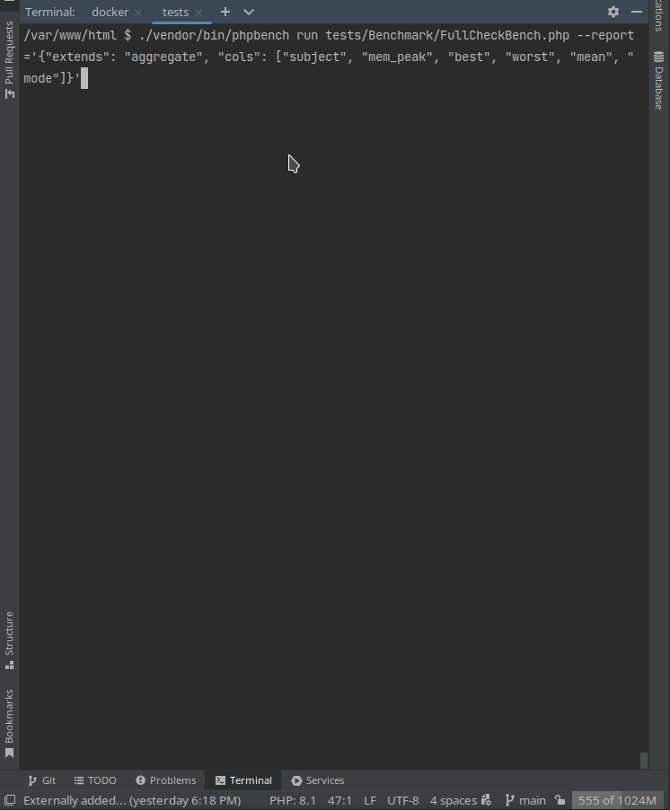

## Benchmark


## Used libraries
1) https://github.com/PerfilovStanislav/php-dto-packer
2) https://github.com/yzen-dev/plain-to-class
3) https://github.com/spatie/data-transfer-object
4) https://github.com/EventSaucePHP/ObjectHydrator
5) https://github.com/TheDragonCode/simple-data-transfer-object
6) https://github.com/symfony/serializer
7) https://github.com/CuyZ/Valinor
8) https://github.com/jolicode/automapper

## Using
```bash
git clone git@github.com:PerfilovStanislav/php-dto-benchmark.git
cd php-dto-benchmark
docker compose up -d
docker compose exec composer sh -c "composer install"
docker compose exec composer sh -c "composer test"
docker compose down
```
