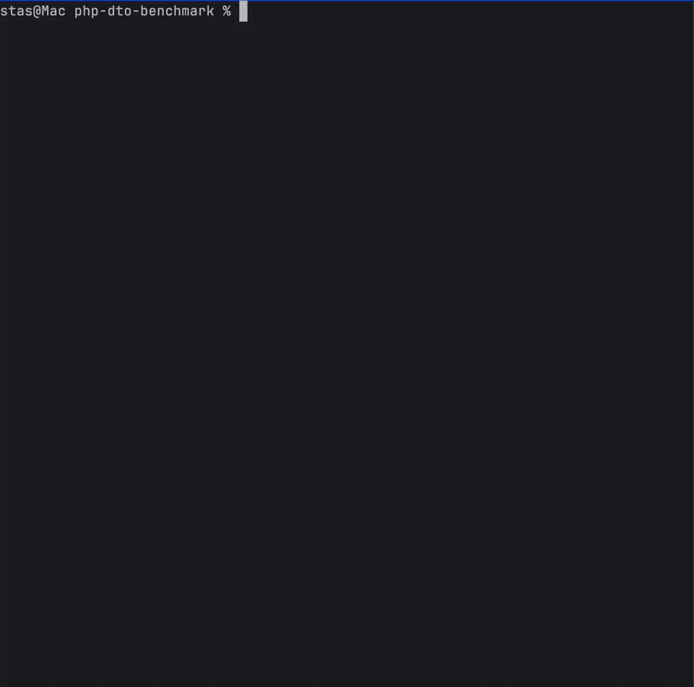

## Benchmark


## Used libraries
1) https://github.com/PerfilovStanislav/php-dto-packer
2) https://github.com/yzen-dev/plain-to-class
3) https://github.com/spatie/data-transfer-object
4) https://github.com/EventSaucePHP/ObjectHydrator
5) https://github.com/TheDragonCode/simple-data-transfer-object
6) https://github.com/symfony/serializer
7) https://github.com/cuyz/valinorfile

## Using
```bash
git clone git@github.com:PerfilovStanislav/php-dto-benchmark.git
cd php-dto-benchmark
docker-compose up -d
docker-compose exec php composer install
docker-compose exec php ./vendor/bin/phpbench run tests/Benchmark/FullCheckBench.php --report='{"extends": "aggregate", "cols": ["subject", "mem_peak", "best", "worst", "mean", "mode"]}'
docker-compose down
```
